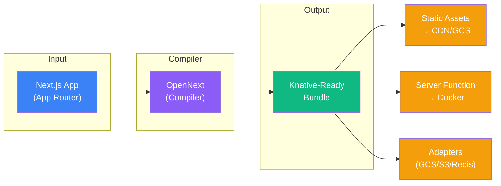
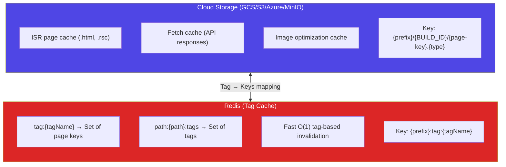
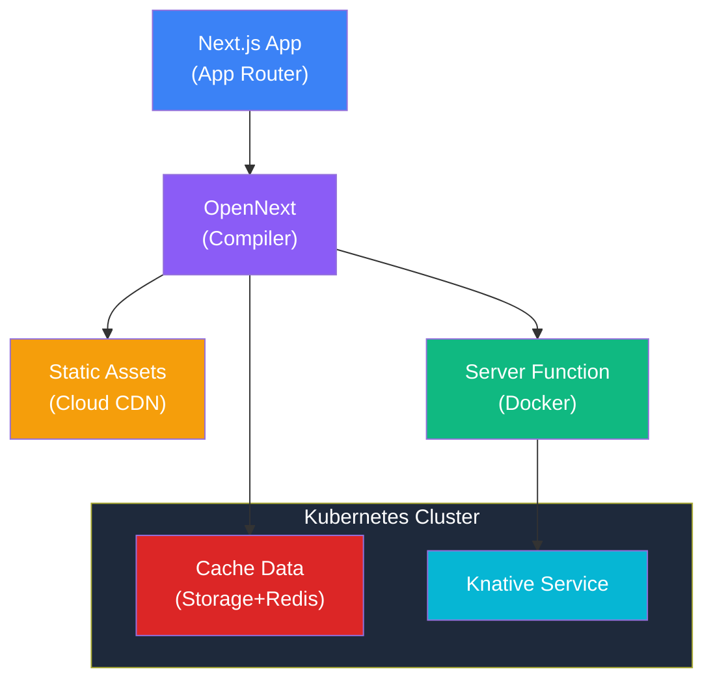

# kn-next: Cloud-Native Next.js for Knative

> **Production-ready framework for deploying Next.js applications on Knative with Fluid Compute characteristics.**

Built on **OpenNext** for serverless compatibility with pluggable adapters for cloud storage (GCS, S3, Azure, MinIO), distributed caching (Redis), and real-time revalidation (Kafka).

---

## Table of Contents

- [Why Knative?](#why-knative)
- [How It Works: OpenNext Builder](#how-it-works-opennext-builder)
- [Features](#features)
- [Quick Start](#quick-start)
- [Configuration Reference](#configuration-reference)
- [Caching & Adapters](#caching--adapters)
- [Multi-Cloud Deployment](#multi-cloud-deployment)
- [Architecture](#architecture)
- [File Manager Demo](#file-manager-demo)
- [Development](#development)

---

## Why Knative?

**Knative** is a Kubernetes-based platform that provides serverless capabilities without lock-in to any specific cloud provider. Unlike AWS Lambda or Vercel's Edge Functions, Knative runs on **any Kubernetes cluster** (GKE, EKS, AKS, or on-premise).

### Benefits

| Feature | Lambda/Vercel | Knative |
|---------|--------------|---------|
| **Portability** | Vendor-locked | Any Kubernetes cluster |
| **Scale-to-Zero** | ✅ | ✅ |
| **Autoscaling** | Managed | Configurable (KPA/HPA) |
| **Cold Starts** | ~200-500ms | Configurable `minScale` |
| **Container Control** | Limited | Full Docker access |
| **Networking** | Platform-managed | Full K8s networking |
| **Cost Model** | Per-invocation | Per-pod-second |

### Use Cases

- **Multi-cloud deployments** requiring platform portability
- **On-premise** or **air-gapped** environments
- **Low-latency** applications needing `minScale: 1` (no cold starts)
- **Hybrid architectures** with existing Kubernetes workloads
- **Cost optimization** for high-traffic applications

---

## How It Works: OpenNext Builder

**OpenNext** is an open-source adapter that transforms Next.js build output into a serverless-compatible format. Originally built for AWS Lambda, we extend it to work with Knative containers.

### Build Pipeline



### What OpenNext Does

1. **Extracts static assets** (`_next/static/`) → uploaded to cloud storage
2. **Bundles server code** (App Router, API routes) → packaged into Docker image
3. **Enables pluggable caching** → custom adapters replace Lambda's cache
4. **Maintains BUILD_ID sync** → ensures client/server assets match

### OpenNext Configuration

The framework generates `open-next.config.ts` automatically from your `kn-next.config.ts`:

```typescript
// Generated open-next.config.ts
const config: OpenNextConfig = {
  default: {
    override: {
      incrementalCache: async () => {
        const mod = await import('@kn-next/config/adapters/redis-cache');
        return mod.default;
      },
      tagCache: async () => {
        const mod = await import('@kn-next/config/adapters/redis-tag-cache');
        return mod.default;
      },
      converter: 'node',
      wrapper: async () => {
        const mod = await import('@kn-next/config/adapters/node-server');
        return mod.default;
      },
    },
  },
};
```

---

## Features

- ✅ **OpenNext Integration** – Compile Next.js for containerized serverless
- ✅ **Fluid Compute** – Scale-to-zero, high concurrency, auto-scaling
- ✅ **Distributed Caching** – GCS/S3 for ISR data + Redis for tag invalidation
- ✅ **Multi-Cloud** – Deploy to GKE, EKS, AKS, or any Kubernetes
- ✅ **Cache Monitoring** – Built-in cache event dashboard
- ✅ **Single-Command Deploy** – Automated build, push, and deploy
- ✅ **Monorepo Ready** – Turborepo for efficient builds

---

## Quick Start

### Prerequisites

- Node.js 20+ or Bun 1.2+
- Docker with buildx
- kubectl configured for your cluster
- Cloud storage bucket (GCS/S3/Azure/MinIO)
- Redis instance (optional, for cache invalidation)

### 1. Install Dependencies

```bash
pnpm install
```

### 2. Configure Your App

Create `kn-next.config.ts` in your app directory:

```typescript
import type { KnativeNextConfig } from '@kn-next/config';

const config: KnativeNextConfig = {
  name: 'my-app',
  
  // Storage for static assets and ISR cache
  storage: {
    provider: 'gcs',           // 'gcs' | 's3' | 'azure' | 'minio'
    bucket: 'my-assets-bucket',
    publicUrl: 'https://storage.googleapis.com/my-assets-bucket',
  },
  
  // Cache for fast tag-based invalidation
  cache: {
    provider: 'redis',
    url: 'redis://redis.default.svc.cluster.local:6379',
    keyPrefix: 'my-app',
  },
  
  // Container registry
  registry: 'gcr.io/my-project',
  
  // Knative autoscaling
  scaling: {
    minScale: 1,   // Keep 1 pod always running (no cold starts)
    maxScale: 10,  // Scale up to 10 pods
  },
};

export default config;
```

### 3. Deploy

```bash
# Using the deploy script
./deploy.sh

# Or using the CLI
npx kn-next deploy
```

This single command:
1. Builds Next.js application
2. Runs OpenNext to generate serverless bundle
3. Syncs static assets to cloud storage
4. Builds & pushes Docker image (tagged with BUILD_ID)
5. Generates Knative manifest
6. Deploys to cluster

---

## Configuration Reference

### Complete Configuration Schema

```typescript
interface KnativeNextConfig {
  // Required: Application name (used for K8s resources)
  name: string;
  
  // Required: Container registry URL
  registry: string;
  
  // Required: Storage configuration
  storage: StorageConfig;
  
  // Optional: Cache configuration (default: none)
  cache?: CacheConfig;
  
  // Optional: ISR revalidation queue (default: none)
  queue?: QueueConfig;
  
  // Optional: Deploy infrastructure services alongside app
  infrastructure?: InfrastructureConfig;
  
  // Optional: Knative autoscaling settings
  scaling?: ScalingConfig;
}
```

### Storage Providers

Configure where static assets and ISR cache data are stored:

```typescript
// Google Cloud Storage
storage: {
  provider: 'gcs',
  bucket: 'my-bucket',
  publicUrl: 'https://storage.googleapis.com/my-bucket',
}

// AWS S3
storage: {
  provider: 's3',
  bucket: 'my-bucket',
  region: 'us-east-1',
  publicUrl: 'https://my-bucket.s3.amazonaws.com',
}

// Azure Blob Storage
storage: {
  provider: 'azure',
  bucket: 'my-container',  // container name
  region: 'eastus',
}

// MinIO (S3-compatible, self-hosted)
storage: {
  provider: 'minio',
  bucket: 'my-bucket',
  endpoint: 'http://minio.default.svc.cluster.local:9000',
  accessKey: 'minioadmin',
  secretKey: 'minioadmin',
}
```

### Cache Providers

Configure distributed cache for tag-based invalidation:

```typescript
// Redis (recommended)
cache: {
  provider: 'redis',
  url: 'redis://redis:6379',
  keyPrefix: 'my-app',    // Optional namespace
  tls: true,              // Enable TLS
}

// DynamoDB (AWS)
cache: {
  provider: 'dynamodb',
  tableName: 'my-app-cache',
  region: 'us-east-1',
}
```

### Queue Providers (ISR Revalidation)

Configure background revalidation queue:

```typescript
// Kafka (Knative Eventing compatible)
queue: {
  provider: 'kafka',
  brokerUrl: 'kafka:9092',
  topic: 'my-app-revalidation',
}

// No queue (synchronous revalidation)
queue: {
  provider: 'none',
}
```

### Infrastructure Services

Auto-deploy PostgreSQL, Redis, or MinIO alongside your app:

```typescript
infrastructure: {
  postgres: {
    enabled: true,
    version: '16',
    storage: '10Gi',
  },
  redis: {
    enabled: true,
    version: '7',
  },
  minio: {
    enabled: true,
    storage: '20Gi',
    accessKey: 'admin',
    secretKey: 'secretpassword',
  },
}
```

### Scaling Configuration

```typescript
scaling: {
  minScale: 0,   // Scale to zero (save costs, but cold starts)
  maxScale: 10,  // Maximum pods
}

// For low-latency requirements
scaling: {
  minScale: 1,   // Always keep 1 pod running
}
```

---

## Caching & Adapters

### Two-Tier Cache Architecture



### Available Adapters

| Adapter | File | Purpose |
|---------|------|---------|
| **GCS Cache** | `gcs-cache.ts` | Store ISR data in Google Cloud Storage |
| **Redis Cache** | `redis-cache.ts` | Store ISR data in Redis (faster, ephemeral) |
| **Redis Tag Cache** | `redis-tag-cache.ts` | Tag-based cache invalidation |
| **Kafka Queue** | `kafka-queue.ts` | Background ISR revalidation queue |
| **Node Server** | `node-server.ts` | HTTP server wrapper for Knative |
| **Cache Events** | `cache-events.ts` | Real-time observability (SSE) |

### Cache Invalidation API

```bash
# Invalidate by tag
curl -X POST http://your-app/api/cache/invalidate \
  -H "Content-Type: application/json" \
  -d '{"tag": "products"}'

# Response
{
  "success": true,
  "message": "Cache invalidated for tag: products",
  "timestamp": "2026-02-05T10:00:00.000Z"
}
```

### Real-time Cache Events

Connect to `/api/cache/events` for Server-Sent Events:

```typescript
const events = new EventSource('/api/cache/events');

events.onmessage = (e) => {
  const event = JSON.parse(e.data);
  // { type: 'HIT', source: 'redis', key: '/products', durationMs: 2 }
};
```

---

## Multi-Cloud Deployment

### Google Cloud (GKE)

```typescript
const config: KnativeNextConfig = {
  name: 'my-app',
  storage: {
    provider: 'gcs',
    bucket: 'my-gcs-bucket',
    publicUrl: 'https://storage.googleapis.com/my-gcs-bucket',
  },
  cache: {
    provider: 'redis',
    url: 'redis://redis.default.svc.cluster.local:6379',
  },
  registry: 'gcr.io/my-project',
};
```

**GKE Prerequisites:**
```bash
# Ensure GCS write access (one of these)
gcloud container node-pools create storage-enabled \
  --scopes="gke-default,storage-full"

# Or use Workload Identity for production
gcloud iam service-accounts add-iam-policy-binding ...
```

### AWS (EKS)

```typescript
const config: KnativeNextConfig = {
  name: 'my-app',
  storage: {
    provider: 's3',
    bucket: 'my-s3-bucket',
    region: 'us-east-1',
    publicUrl: 'https://my-s3-bucket.s3.amazonaws.com',
  },
  cache: {
    provider: 'redis',
    url: 'redis://my-elasticache.xxx.cache.amazonaws.com:6379',
    tls: true,
  },
  registry: '123456789.dkr.ecr.us-east-1.amazonaws.com',
};
```

**EKS Prerequisites:**
```bash
# Configure IAM roles for S3 access
eksctl create iamserviceaccount \
  --name default \
  --namespace default \
  --cluster my-cluster \
  --attach-policy-arn arn:aws:iam::aws:policy/AmazonS3FullAccess
```

### Azure (AKS)

```typescript
const config: KnativeNextConfig = {
  name: 'my-app',
  storage: {
    provider: 'azure',
    bucket: 'my-container',
    region: 'eastus',
  },
  cache: {
    provider: 'redis',
    url: 'redis://my-redis.redis.cache.windows.net:6380',
    tls: true,
  },
  registry: 'myregistry.azurecr.io',
};
```

### On-Premise / MinIO

```typescript
const config: KnativeNextConfig = {
  name: 'my-app',
  storage: {
    provider: 'minio',
    bucket: 'assets',
    endpoint: 'http://minio.storage.svc.cluster.local:9000',
    accessKey: process.env.MINIO_ACCESS_KEY,
    secretKey: process.env.MINIO_SECRET_KEY,
  },
  cache: {
    provider: 'redis',
    url: 'redis://redis.cache.svc.cluster.local:6379',
  },
  registry: 'registry.internal.local:5000',
  infrastructure: {
    minio: { enabled: true, storage: '50Gi' },
    redis: { enabled: true },
  },
};
```

---

## Architecture

See [docs/ARCHITECTURE.md](./docs/ARCHITECTURE.md) for detailed diagrams including:
- System architecture (Mermaid)
- Request/response flow
- Cache invalidation flow
- Deployment pipeline

### High-Level Overview



### Project Structure

```
├── apps/
│   └── file-manager/           # Example Next.js 16 app
│       ├── kn-next.config.ts   # App configuration
│       ├── deploy.sh           # Deployment script
│       └── src/app/            # App Router pages
│
├── packages/
│   ├── kn-next/                # Core framework package
│   │   ├── src/adapters/       # GCS, Redis, Kafka adapters
│   │   ├── src/generators/     # Manifest generators
│   │   └── src/cli/            # CLI tools (build, deploy)
│   └── lib/                    # Shared utilities
│
└── docs/
    └── ARCHITECTURE.md         # Detailed architecture
```

---

## File Manager Demo

The example app demonstrates all framework capabilities:

- File upload/download with MinIO/GCS
- PostgreSQL metadata storage
- Real-time cache monitoring
- Paginated audit logs with infinite scroll
- Tag-based cache invalidation
- **Cache testing playground** with various strategies

### Demo Pages

| Page | URL | Description |
|------|-----|-------------|
| Home | `/` | File listing |
| Dashboard | `/dashboard` | Statistics |
| Audit Logs | `/audit` | Activity log |
| Cache Monitor | `/cache` | Real-time events |
| **Cache Tests** | `/cache-tests` | Testing playground |

### Cache Testing Playground

| Test | URL | Strategy |
|------|-----|----------|
| Time-based | `/cache-tests/time-based` | `revalidate: 60` |
| On-demand | `/cache-tests/on-demand` | `revalidateTag()` |
| Fetch cache | `/cache-tests/fetch-cache` | `force-cache` |
| Parallel | `/cache-tests/parallel` | Concurrent fetches |
| Nested | `/cache-tests/nested` | Layout caching |
| Dynamic/Static | `/cache-tests/dynamic-static` | Rendering modes |

---

## Development

### Local Development

```bash
cd apps/file-manager
pnpm dev
```

### Build & Deploy

```bash
# Full deployment with defaults
npx kn-next deploy

# Or step-by-step
npx kn-next build       # Build + OpenNext
npx kn-next deploy      # Deploy to cluster
npx kn-next cleanup     # Remove from cluster
```

### CLI Reference

```bash
npx kn-next deploy [options]
```

| Option | Short | Description |
|--------|-------|-------------|
| `--registry <url>` | `-r` | Override container registry |
| `--bucket <name>` | `-b` | Override storage bucket |
| `--tag <tag>` | `-t` | Image tag (default: timestamp) |
| `--namespace <ns>` | `-n` | Kubernetes namespace (default: default) |
| `--skip-build` | | Skip Next.js/OpenNext build |
| `--skip-upload` | | Skip asset upload to storage |
| `--skip-infra` | | Skip infrastructure deployment |
| `--dry-run` | | Generate manifests without deploying |
| `--help` | `-h` | Show help |

### Environment Variables (CI/CD)

These environment variables can be used instead of CLI flags:

| Variable | Description |
|----------|-------------|
| `KN_REGISTRY` | Container registry URL |
| `KN_BUCKET` | Storage bucket name |
| `KN_IMAGE_TAG` | Docker image tag |
| `KN_NAMESPACE` | Kubernetes namespace |
| `KN_REDIS_URL` | Redis connection URL (overrides config) |
| `KN_DATABASE_URL` | Database connection URL (overrides config) |

### CI/CD Examples

**GitHub Actions:**
```yaml
- name: Deploy to Knative
  env:
    KN_REGISTRY: gcr.io/${{ secrets.GCP_PROJECT }}
    KN_IMAGE_TAG: ${{ github.sha }}
    KN_NAMESPACE: production
    KN_REDIS_URL: ${{ secrets.REDIS_URL }}
    KN_DATABASE_URL: ${{ secrets.DATABASE_URL }}
  run: npx kn-next deploy
```

**GitLab CI:**
```yaml
deploy:
  script:
    - npx kn-next deploy --tag $CI_COMMIT_SHA --namespace production
  variables:
    KN_REGISTRY: gcr.io/my-project
    KN_REDIS_URL: $REDIS_URL
```

**Production with specific tag:**
```bash
npx kn-next deploy --tag v1.2.3 --namespace production
```

**Preview manifest only:**
```bash
npx kn-next deploy --dry-run
```

---

## License

MIT
