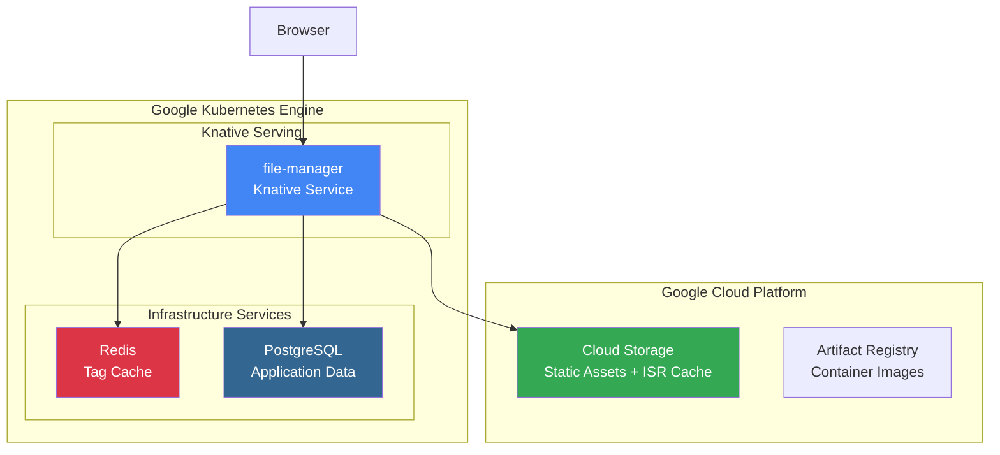
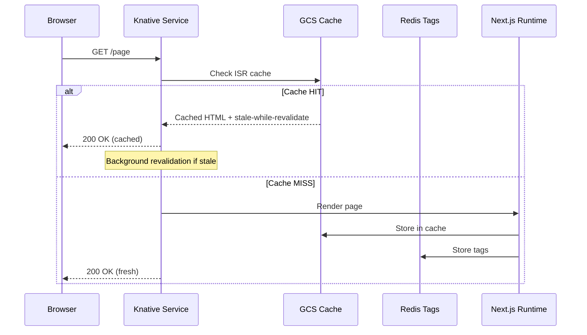
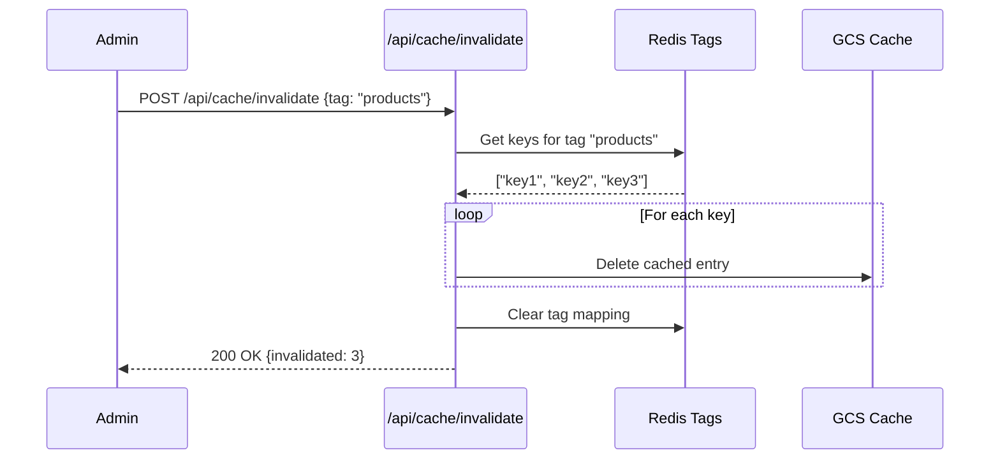
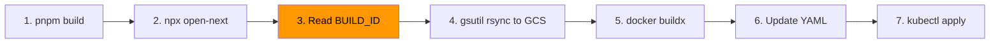

# Knative Next.js Architecture

## Overview

This framework enables deploying Next.js applications as Knative services on GKE with Fluid Compute characteristics. It uses **OpenNext** to compile Next.js into a standalone server compatible with containerized environments, while providing pluggable adapters for storage, caching, and messaging.

## System Architecture



## Key Components

### 1. OpenNext Integration

OpenNext transforms Next.js build output into a serverless-compatible format:

```
.open-next/
├── assets/                  # Static files → GCS
│   ├── BUILD_ID             # Unique build identifier
│   └── _next/static/        # JS, CSS, fonts
├── server-functions/
│   └── default/             # Node.js server → Docker image
└── cache/                   # Pre-rendered pages
```

### 2. kn-next Package

The `@kn-next/config` package provides pluggable adapters:

| Adapter | Purpose | Implementation |
|---------|---------|----------------|
| **GCS Cache** | ISR data cache | `gcs-cache.ts` |
| **Redis Tag Cache** | Cache invalidation tags | `redis-tag-cache.ts` |
| **Kafka Queue** | Revalidation queue | `kafka-queue.ts` |
| **Node Server** | HTTP server wrapper | `node-server.ts` |

### 3. Configuration System

```
kn-next.config.ts           # User configuration
        ↓
    kn-next build
        ↓
open-next.config.ts         # Auto-generated OpenNext config
```

**Example `kn-next.config.ts`:**

```typescript
const config: KnativeNextConfig = {
    name: 'file-manager',
    storage: {
        provider: 'gcs',
        bucket: 'knative-next-assets-banna',
        publicUrl: 'https://storage.googleapis.com/knative-next-assets-banna',
    },
    cache: {
        provider: 'redis',
        url: 'redis://redis.default.svc.cluster.local:6379',
        keyPrefix: 'file-manager',
    },
    registry: 'us-central1-docker.pkg.dev/gsw-mcp/knative-next-repo',
};
```

## Data Flow

### Request Flow



### Cache Invalidation Flow



## Deployment Pipeline

The `deploy.sh` script automates the entire deployment:



**BUILD_ID Synchronization:**

The BUILD_ID ensures server and client assets are always in sync:

- Docker image tagged: `file-manager:build-{BUILD_ID}`
- Static assets in GCS: `gs://bucket/_next/static/{BUILD_ID}/`
- Both reference the same BUILD_ID at runtime

## Caching Architecture

### Two-Tier Cache

```
┌─────────────────────────────────────────────────────┐
│                     GCS (Data Cache)                │
│  - ISR page cache                                   │
│  - Fetch cache                                      │
│  - Image optimization cache                         │
│  Keyed by: {prefix}/{BUILD_ID}/{key}.{type}        │
└─────────────────────────────────────────────────────┘
                          ▲
                          │ Keys lookup for invalidation
                          ▼
┌─────────────────────────────────────────────────────┐
│                  Redis (Tag Cache)                  │
│  - Tag → Keys mapping                              │
│  - Fast O(1) invalidation                          │
│  Keyed by: {prefix}:tag:{tagName}                  │
└─────────────────────────────────────────────────────┘
```

### Cache Events (Observability)

The cache system emits real-time events via SSE:

```typescript
// Server-Sent Events at /api/cache/events
interface CacheEvent {
    type: 'HIT' | 'MISS' | 'SET' | 'DELETE' | 'REVALIDATE';
    layer: 'gcs' | 'redis';
    key: string;
    timestamp: number;
    durationMs?: number;
    details?: string;
}
```

## Environment Variables

| Variable | Description | Default |
|----------|-------------|---------|
| `GCS_BUCKET_NAME` | GCS bucket for cache | Required |
| `GCS_BUCKET_KEY_PREFIX` | Key prefix in bucket | `''` |
| `GOOGLE_APPLICATION_CREDENTIALS` | SA key path | ADC |
| `REDIS_URL` | Redis connection URL | Required |
| `NEXT_BUILD_ID` | From OpenNext build | Auto |
| `DATABASE_URL` | PostgreSQL connection | Required |

## API Endpoints

| Endpoint | Method | Description |
|----------|--------|-------------|
| `/api/health` | GET | Health check |
| `/api/audit` | GET | Paginated audit logs |
| `/api/cache-stats` | GET | Cache statistics |
| `/api/cache/events` | GET | SSE cache events stream |
| `/api/cache/invalidate` | POST | Invalidate by tag |

## Project Structure

```
knative-next-monorepo/
├── apps/
│   └── file-manager/           # Example Next.js 16 application
│       ├── kn-next.config.ts   # App configuration
│       ├── open-next.config.ts # Generated OpenNext config
│       ├── deploy.sh           # Deployment automation
│       ├── knative-service.yaml
│       └── src/app/            # App Router pages
│
├── packages/
│   ├── kn-next/                # Core framework package
│   │   └── src/
│   │       ├── adapters/       # Cache & queue adapters
│   │       ├── config.ts       # Config type definitions
│   │       └── loader.ts       # Runtime loader
│   │
│   └── lib/                    # Shared utilities
│       └── src/clients.ts      # DB/storage clients
│
├── docs/
│   └── ARCHITECTURE.md         # This document
│
└── README.md
```

## Knative Configuration

**Key Settings:**

```yaml
autoscaling.knative.dev/minScale: "1"      # Always-on (avoid cold starts)
autoscaling.knative.dev/maxScale: "5"      # Max replicas
autoscaling.knative.dev/target: "100"      # Concurrent requests per pod
```

**Volume Mounts for GCS:**

```yaml
volumeMounts:
  - name: gcs-credentials
    mountPath: /secrets/gcs
    readOnly: true
volumes:
  - name: gcs-credentials
    secret:
      secretName: gcs-credentials
```

## CLI Reference

The `kn-next` CLI provides commands for building and deploying Next.js applications to Knative.

### Deploy Command

```bash
npx kn-next deploy [options]
```

#### Options

| Option | Short | Description |
|--------|-------|-------------|
| `--registry <url>` | `-r` | Override container registry |
| `--bucket <name>` | `-b` | Override storage bucket |
| `--tag <tag>` | `-t` | Image tag (default: timestamp) |
| `--namespace <ns>` | `-n` | Kubernetes namespace (default: default) |
| `--skip-build` | | Skip Next.js/OpenNext build step |
| `--skip-upload` | | Skip asset upload to storage |
| `--skip-infra` | | Skip infrastructure deployment |
| `--dry-run` | | Generate manifests without deploying |
| `--help` | `-h` | Show help |

#### Environment Variables (CI/CD)

These environment variables can override config file values, useful for CI/CD pipelines:

| Variable | Description |
|----------|-------------|
| `KN_REGISTRY` | Container registry URL |
| `KN_BUCKET` | Storage bucket name |
| `KN_IMAGE_TAG` | Docker image tag |
| `KN_NAMESPACE` | Kubernetes namespace |
| `KN_REDIS_URL` | Redis connection URL (overrides config) |
| `KN_DATABASE_URL` | Database connection URL (overrides config) |

### CI/CD Integration

#### GitHub Actions

```yaml
name: Deploy to Knative

on:
  push:
    branches: [main]

jobs:
  deploy:
    runs-on: ubuntu-latest
    steps:
      - uses: actions/checkout@v4
      
      - uses: actions/setup-node@v4
        with:
          node-version: '20'
          
      - name: Install dependencies
        run: pnpm install
        
      - name: Configure GCP
        uses: google-github-actions/auth@v2
        with:
          credentials_json: ${{ secrets.GCP_SA_KEY }}
          
      - name: Set up Cloud SDK
        uses: google-github-actions/setup-gcloud@v2
        
      - name: Configure kubectl
        run: |
          gcloud container clusters get-credentials ${{ vars.GKE_CLUSTER }} \
            --zone ${{ vars.GKE_ZONE }}
            
      - name: Deploy to Knative
        working-directory: apps/file-manager
        env:
          KN_REGISTRY: gcr.io/${{ secrets.GCP_PROJECT }}
          KN_IMAGE_TAG: ${{ github.sha }}
          KN_NAMESPACE: production
          KN_REDIS_URL: ${{ secrets.REDIS_URL }}
          KN_DATABASE_URL: ${{ secrets.DATABASE_URL }}
        run: npx kn-next deploy
```

#### GitLab CI

```yaml
stages:
  - build
  - deploy

variables:
  KN_REGISTRY: gcr.io/my-project

deploy_production:
  stage: deploy
  image: google/cloud-sdk:slim
  before_script:
    - gcloud auth activate-service-account --key-file=$GCP_KEY
    - gcloud container clusters get-credentials $GKE_CLUSTER --zone $GKE_ZONE
  script:
    - cd apps/file-manager
    - npx kn-next deploy --tag $CI_COMMIT_SHA --namespace production
  environment:
    name: production
  only:
    - main
```

#### Azure DevOps

```yaml
trigger:
  - main

pool:
  vmImage: 'ubuntu-latest'

steps:
  - task: NodeTool@0
    inputs:
      versionSpec: '20.x'
      
  - script: pnpm install
    displayName: 'Install dependencies'
    
  - task: AzureCLI@2
    displayName: 'Deploy to Knative'
    inputs:
      azureSubscription: 'my-subscription'
      scriptType: 'bash'
      scriptLocation: 'inlineScript'
      inlineScript: |
        az aks get-credentials --resource-group myRG --name myCluster
        cd apps/file-manager
        npx kn-next deploy --tag $(Build.SourceVersion) --namespace production
    env:
      KN_REGISTRY: myregistry.azurecr.io
      KN_DATABASE_URL: $(DATABASE_URL)
```

### Build Command

```bash
npx kn-next build
```

Runs the following steps:
1. Generates `open-next.config.ts` from `kn-next.config.ts`
2. Runs `npm run build` (Next.js build)
3. Runs `npx open-next build` (OpenNext compilation)
4. Copies adapter files to `.open-next/`

### Cleanup Command

```bash
npx kn-next cleanup [--namespace <ns>]
```

Removes deployed resources from the cluster:
- Knative Service
- Infrastructure services (if deployed)

## Development Workflow

1. **Local Development:**
   ```bash
   cd apps/file-manager
   pnpm dev
   ```

2. **Build for Production:**
   ```bash
   cd apps/file-manager
   npx kn-next deploy
   ```

3. **Deploy to Staging:**
   ```bash
   npx kn-next deploy --namespace staging --tag staging-$(date +%s)
   ```

4. **Preview Manifest (Dry Run):**
   ```bash
   npx kn-next deploy --dry-run
   cat .open-next/knative-service.yaml
   ```

5. **Manual Steps (if needed):**
   ```bash
   # Build Next.js + OpenNext
   cd apps/file-manager
   pnpm build
   npx open-next build
   
   # Sync assets
   gsutil -m rsync -r .open-next/assets gs://bucket
   
   # Build & push image
   docker buildx build --platform linux/amd64 \
     -t registry/file-manager:tag -f Dockerfile . --push
   
   # Deploy
   kubectl apply -f .open-next/knative-service.yaml
   ```

## Future Roadmap

- [ ] CLI tool for initialization (`npx kn-next init`)
- [x] CI/CD parameter support
- [ ] Multi-zone support with shared cache
- [ ] Edge middleware on Cloudflare Workers
- [ ] Automatic Dockerfile generation
- [x] GitHub Actions workflow examples
